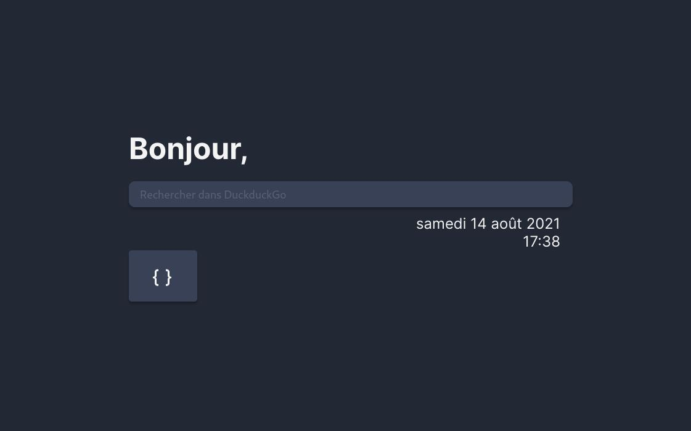
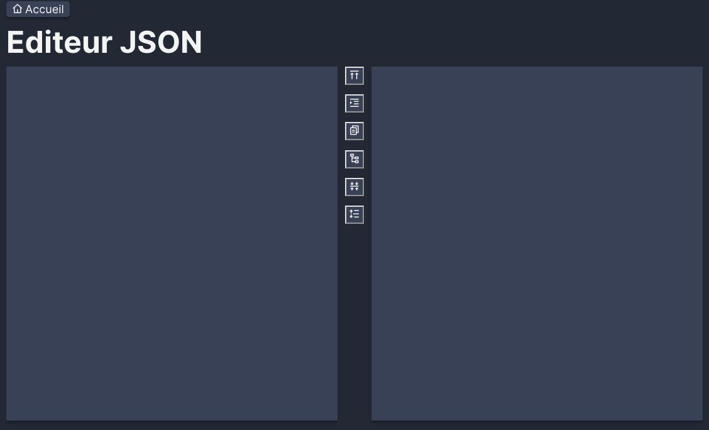

# Startpage

Ce projet consiste à créer une startpage simple (page par défaut lors de l'ouverture d'un nouvel onglet d'un navigateur) avec différents modules (éditeur JSON, XML, Regex...). Ce projet a été principalement créé pour faire de la veille JS.

## Objectifs 

- Création d'un mini framework MVC en Vanilla JS
- Single page app
- Test de [Parcel](https://parceljs.org/)
- Test de [Standard JS](https://standardjs.com/)
- Minimiser les dépendances

## Screenshots

## Crédits 

- Icons : [REMIX ICON](http://remixicon.com/)